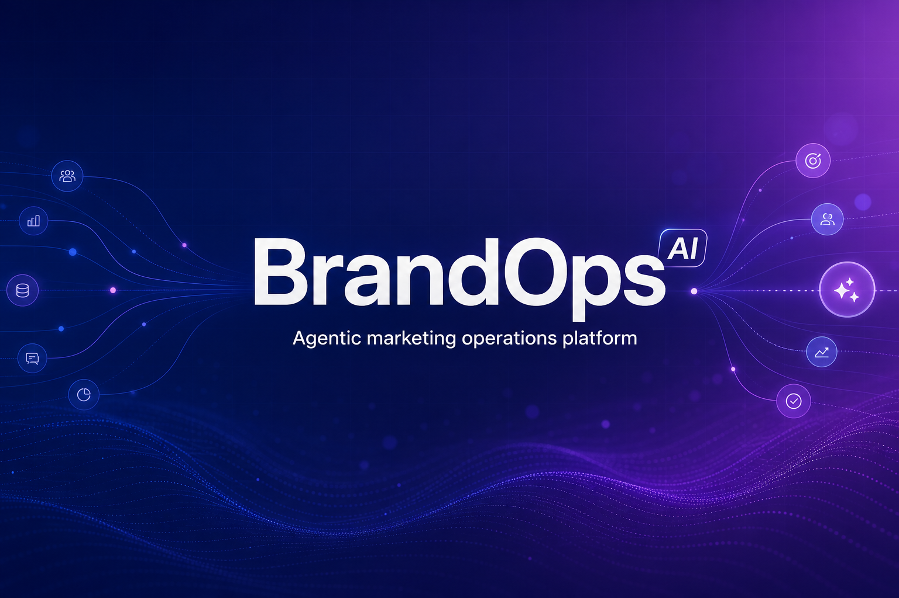
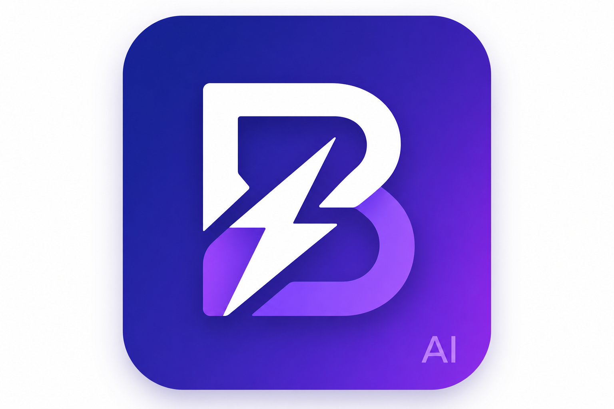
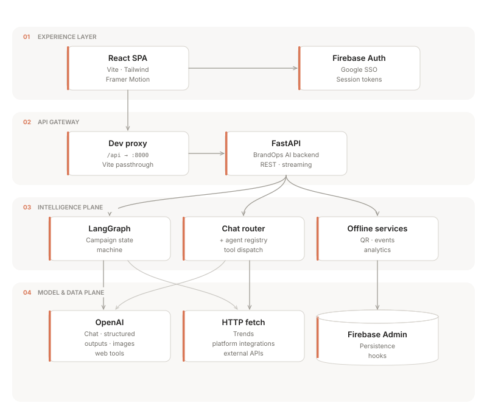
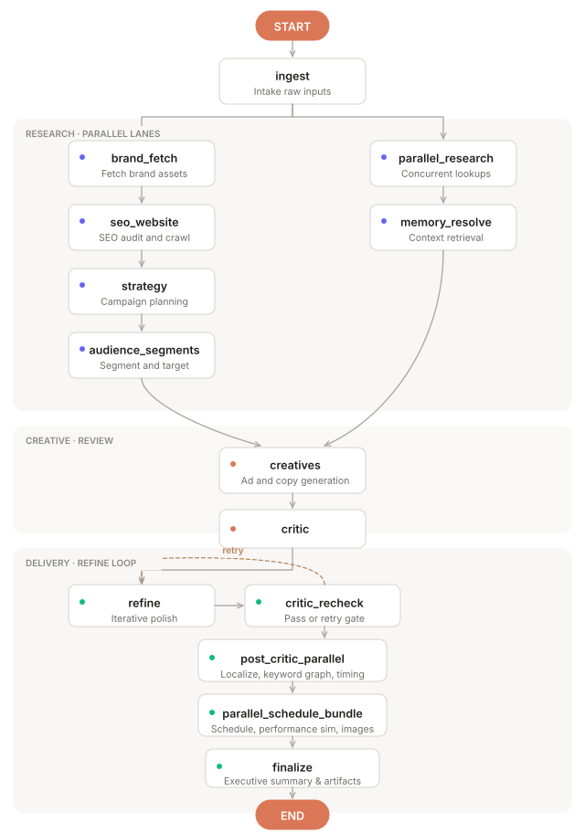
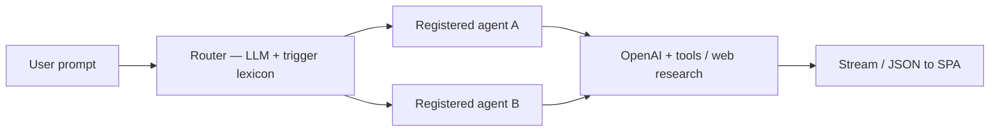

<div align="center">



<br/>



# **BrandOps AI**

### *The agentic layer for brand & growth marketing*

Orchestrate **research**, **strategy**, **multi-channel creative**, **QA loops**, and **delivery**—with LangGraph-grade pipelines, Firebase-backed identity, and a React workspace your team will actually live in.

<br/>

[](https://fastapi.tiangolo.com/)
[](https://langchain-ai.github.io/langgraph/)
[](https://openai.com/)
[](https://react.dev/)
[](https://vitejs.dev/)
[](https://www.typescriptlang.org/)
[](https://tailwindcss.com/)
[](https://firebase.google.com/)

<br/>

**[Platform](#platform-overview)** · **[Campaign pipeline](#campaign-intelligence-pipeline-langgraph)** · **[Ask agents](#conversational-agents--ask)** · **[Tech stack](#technology-stack)** · **[Run locally](#quick-start)**

</div>

---

## At a glance

| Pillar | What BrandOps AI does |
|:--|:--|
| **Signal, not noise** | Web-grounded research, competitor views, keyword graphs (NetworkX / PageRank), and trend-aware planning—not generic chat output. |
| **Closed-loop creative** | Multi-channel drafts with a **critic → refine → recheck** loop until quality thresholds or iteration caps are met. |
| **Operational delivery** | Content schedules, performance simulation, image generation for scheduled posts, calendar-ready artifacts. |
| **Omnichannel + real world** | Online campaigns plus **offline** flows: QR landing pages, event capture, and analytics. |
| **Governed access** | Firebase Auth, API bearer verification, and admin routes gated by configured operator emails. |

---

## Platform overview

High-level shape of the product: a Vite/React SPA talks to a FastAPI backend that hosts **(1)** a compiled LangGraph campaign pipeline, **(2)** a streaming chat router over registered marketing “agents,” and **(3)** media/offline services.

<div align="center">



<sub>Architecture diagram: <code>assets/brandops_architecture_diagram.svg</code></sub>

</div>

---

## Campaign intelligence pipeline (LangGraph)

The **campaign graph** is a `StateGraph` over `CampaignState`: each node is an async agent step; edges encode control flow including **conditional QA loops** and **fan-out parallel** stages. The graph is built in `backend/app/graph/builder.py` and compiled once at API startup.

### Stage map

| Phase | Node (id) | Role |
|:--|:--|:--|
| Intake | `ingest` | Normalize request / brief into runnable state. |
| Brand truth | `brand_fetch` | Pull brand-facing context from the open web (positioning signals). |
| Research | `parallel_research` | Concurrent competitor / market / social intel passes. |
| SEO & site | `seo_website` | Website and SEO-oriented optimization artifacts. |
| Strategy | `strategy` | Positioning, messaging architecture, channel logic. |
| Audience | `audience_segments` | Segment hypotheses aligned to strategy. |
| Memory | `memory_resolve` | Resolve conflicts / consolidate “memory” before creative. |
| Creative | `creatives` | Full creative suite (SEO, social, video concepts, messaging, etc.). |
| QA | `critic` | Scoring and structured critique against channel rubrics. |
| QA loop | `refine` → `critic_recheck` | Iterative improvement until scores clear thresholds or **max refine rounds** (settings-driven). |
| Enrichment | `post_critic_parallel` | **Parallel** localization, keyword graph, and publish timing. |
| Delivery | `parallel_schedule_bundle` | **Parallel** content schedule + performance simulation, then **per-post images** for eligible rows. |
| Bundle | `finalize` | Executive summary + `CampaignArtifacts` assembly for the client workspace. |

### Control-flow diagram

<div align="center">



<sub>Workflow diagram: <code>assets/campaign_workflow_diagram.svg</code>. Compiled graph: <code>backend/app/graph/builder.py</code>. Parallel lanes are <strong>diagrammatic</strong>; see the stage table above for exact node order in code.</sub>

</div>

**Parallel internals (backend):**

- **`post_critic_parallel`** — runs `localize`, `keyword_graph`, and `timing` concurrently (`asyncio.gather`).
- **`parallel_schedule_bundle`** — runs `content_schedule` and `performance_sim` in parallel, merges state, then **`schedule_post_images`** for rows that need visuals (budget-aware).

Traceability: nodes emit **structured trace steps**, **activities**, and optional **token usage events** so the UI can show how a run reasoned—not just final JSON.

---

## Conversational agents (“Ask”)

Separate from the long-running campaign graph, the **chat router** (`backend/app/services/chat.py`) maintains an **`AGENT_REGISTRY`**: intent triggers map user messages to specialized agents. The router can orchestrate multi-agent replies and stream structured output to the client.

| Agent id | Name | Focus |
|:--|:--|:--|
| `competitor_intel` | Competitor Intelligence | Positioning, pricing posture, campaigns, benchmarking. |
| `social_intel` | Social Media Intelligence | Reddit, LinkedIn, Instagram, YouTube, influencer and engagement patterns. |
| `market_trends` | Market Trends Analyst | Macro trends, seasonality, regulatory and industry shifts. |
| `brand_analyst` | Brand Site Analyst | Crawl / analyze owned sites for IA, tone, and product narrative. |
| `strategy` | Strategy Synthesizer | GTM, positioning, audiences, messaging pillars, channel plan. |
| `creative_suite` | Creative Suite | Copy, hooks, SEO, email, WhatsApp, video concepts. |
| `keyword_engine` | Keyword Graph Engine | Co-occurrence graphs, PageRank-weighted clusters for search strategy. |
| `performance_sim` | Performance Simulator | Confidence-weighted reach / engagement / conversion outlooks. |



---

## Technology stack

| Layer | Choices | Notes |
|:--|:--|:--|
| **Frontend** | React 18, TypeScript, Vite 5, Tailwind CSS, Framer Motion, Recharts, Lucide | App router in `react-router-dom` v7; `/api` dev proxy in `vite.config.ts`. |
| **AuthN** | Firebase Auth (Google provider) | JWT bearer on `apiFetch`; public JSON helpers for landing pages. |
| **Backend** | FastAPI, Uvicorn, Pydantic v2 + settings | CORS from `CORS_ORIGINS`; lifespan wires OpenAI client + compiled graph. |
| **Orchestration** | LangGraph, LangChain Core | Stateful campaign runs with conditional edges and merges. |
| **Models & tools** | OpenAI API (chat, structured outputs, image flows, web search tool) | Model IDs configurable (`OPENAI_MODEL`, `OPENAI_MODEL_FAST`). |
| **Analytics & graph** | NumPy, SciPy, NetworkX | Keyword graph / ranking-style workloads. |
| **Media** | Custom image pipeline + configurable HTTP image backend | Concurrency caps in settings for cost/latency control. |
| **Offline** | QR (`segno`), geo hints, Firebase admin hooks | Public slug routes in SPA; scan and event ingestion via API. |
| **Optional social** | instagrapi, YouTube Data API | Behind env flags; use secondary/burner accounts where applicable. |

---

## Quick start

### Prerequisites

- **Python 3.11+** recommended  
- **Node.js 18+**  
- **OpenAI API key** (required)  
- **Firebase** web + Admin project (for auth and server features)

### Backend

```bash
cd backend
python -m venv .venv
source .venv/bin/activate   # Windows: .venv\Scripts\activate
pip install -r requirements.txt
```

Minimal **`backend/.env`**:

```env
OPENAI_API_KEY=sk-...
```

```bash
python run.py
# http://127.0.0.1:8000
```

### Frontend

```bash
cd frontend
npm install
```

**`frontend/.env`** — Firebase client keys (`VITE_FIREBASE_*`).

```bash
npm run dev
# http://localhost:5173 — proxies /api to the backend
```

---

## Configuration (selected)

| Variable | Purpose |
|:--|:--|
| `OPENAI_API_KEY` | **Required** |
| `OPENAI_MODEL` / `OPENAI_MODEL_FAST` | Primary vs. fast/cheap models |
| `CORS_ORIGINS` | Browser origins allowed by API |
| `PUBLIC_APP_URL` | Base URL for offline QR destinations |
| `ADMIN_EMAILS` | Operators allowed on `/admin` |
| `YOUTUBE_API_KEY`, `INSTAGRAPI_*` | Optional integrations |

Never commit real `.env` files or private keys.

---

## Repository layout

```
KnowWiz/
├── assets/
│   ├── readme-hero.png                   # README banner (BrandOps AI)
│   ├── brandops_architecture_diagram.svg # System architecture (README)
│   └── campaign_workflow_diagram.svg     # Campaign workflow (README)
├── backend/
│   ├── app/
│   │   ├── main.py                  # FastAPI app + routes
│   │   ├── graph/                   # LangGraph builder, nodes, state
│   │   ├── services/                # LLM, chat, images, offline, …
│   │   └── schemas/
│   ├── requirements.txt
│   └── run.py
└── frontend/
    ├── public/
    │   └── assets/
    │       └── logo-brandops-ai.png # App icon / logo asset
    ├── src/                         # Pages, components, contexts
    ├── package.json
    └── vite.config.ts
```

---

<div align="center">

**BrandOps AI** — *Ship campaigns with receipts: traceable agents, structured artifacts, operational delivery.*

</div>
